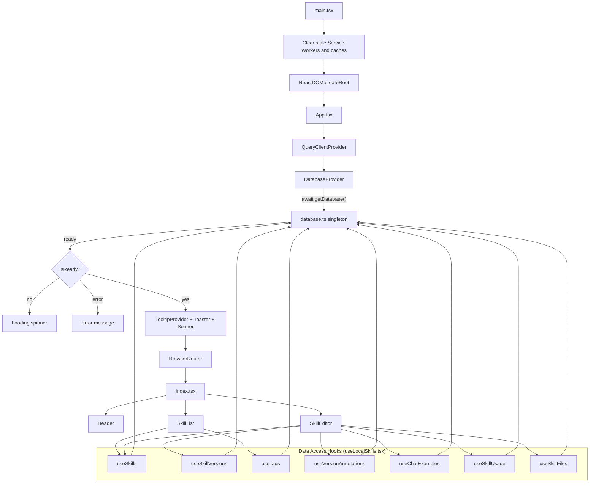

# Application Flow

How Skill Keep boots and how components connect.

## Boot Sequence

1. **main.tsx**: Unregisters stale service workers, clears browser caches, then mounts React
2. **App.tsx**: Sets up `QueryClientProvider` then `DatabaseProvider`
3. **DatabaseProvider**: Calls `getDatabase()` (promise singleton). Blocks rendering until DB is ready
4. **Index.tsx**: Renders the main UI once the database gate opens

## Key Architectural Decisions

- **Single entry point for DB**: All code uses `getDatabase()` which returns the same promise. No race conditions possible.
- **DatabaseProvider gates rendering**: No component can attempt DB access before initialization completes.
- **React Query manages cache**: All reads go through `useQuery`, all writes through `useMutation` with cache invalidation.
- **No backend dependency**: All data lives in the browser via sql.js + IndexedDB.
