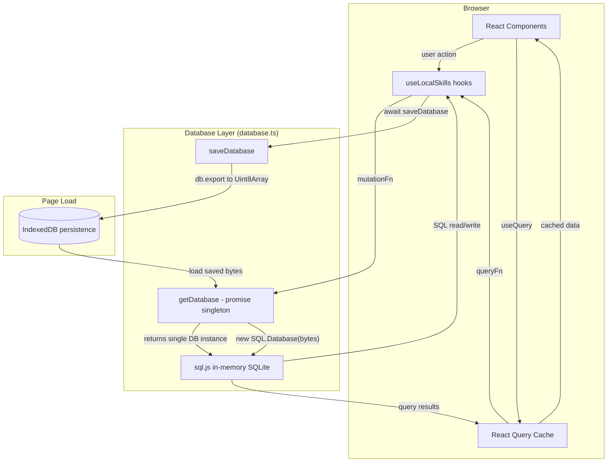

# Data Flow

How data moves through Skill Keep.

## Write Path

1. User clicks create/edit/delete in a React component
2. Component calls a mutation from `useLocalSkills` hooks
3. Mutation's `mutationFn` calls `await getDatabase()` to get the singleton DB
4. Runs SQL statements against the in-memory sql.js database
5. Calls `await saveDatabase()` which exports the DB to a `Uint8Array` and writes it to IndexedDB
6. `onSuccess` invalidates React Query cache, triggering re-fetch

## Read Path

1. React Query `queryFn` calls `await getDatabase()`
2. Runs SELECT queries against in-memory sql.js
3. Maps raw row arrays to typed objects
4. Returns to React Query cache, which provides data to components

## Persistence

- **In-memory**: sql.js `Database` object (fast reads/writes)
- **Durable**: IndexedDB store `sqlite-store` with key `database` (survives page reload)
- Every mutation calls `saveDatabase()` to sync memory to disk
